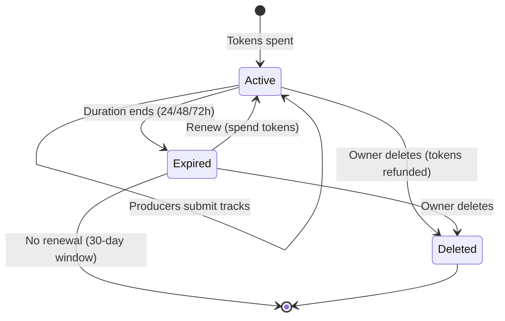

## Overview

The Beat Requests API powers the custom beat request marketplace. Users spend tokens to create time-limited requests specifying their needs (genre, BPM, mood, budget). Producers browse active requests and submit tracks to fulfill them.

<Info>
  **Base URL:** `https://open.beatpass.ca/api/v1/beat-requests`

  **Authentication:** All beat request endpoints require a valid Bearer token.
</Info>

---

## Request Lifecycle

<Steps>
  <Step title="Create Request">
    User spends tokens to create a beat request with specifications (genre, BPM, mood, budget, reference track). Requests are active for 24, 48, or 72 hours.
  </Step>
  <Step title="Producers Browse">
    Producers view active requests and submit tracks that match the specifications.
  </Step>
  <Step title="Review Submissions">
    The requester reviews submitted tracks and connects with producers directly if interested.
  </Step>
  <Step title="Expire or Renew">
    Requests expire automatically after the chosen duration (24/48/72h). Expired requests can be renewed within 30 days by spending tokens again.
  </Step>
</Steps>



---

## Token System

Beat requests use a token-based system tied to the user's subscription plan:

<CardGroup cols={3}>
  <Card title="Token Cost" icon="coins">
    24h = 1 token, 48h = 2 tokens, 72h = 3 tokens
  </Card>
  <Card title="Monthly Allocation" icon="calendar">
    Tokens refresh monthly based on subscription plan
  </Card>
  <Card title="Refunds" icon="rotate-left">
    Tokens are refunded when the owner deletes a request (capped at plan allowance)
  </Card>
</CardGroup>

---

## Endpoints

### List Active Requests

Get all active beat requests on the marketplace.

```http
GET /api/v1/beat-requests
```

**Response:**

```json
{
  "success": true,
  "data": [
    {
      "id": "req_abc123",
      "user_id": 1,
      "user_name": "BeatBuyer",
      "content": "Looking for dark trap beat, 140 BPM...",
      "genre": "Trap",
      "bpm_range": "135-145",
      "mood": "Dark",
      "budget": "\$50-100",
      "expires_at": "2025-01-16T14:30:00Z",
      "time_remaining": "23 hours from now",
      "hours_remaining": 23
    }
  ],
  "count": 5
}
```

---

### Create Request

Create a new beat request by spending tokens.

```http
POST /api/v1/beat-requests
```

<ParamField body="content" type="string" required>
  Description of the beat you're looking for.
</ParamField>
<ParamField body="reference_track" type="string" required>
  Reference track URL or description for producers to understand the style.
</ParamField>
<ParamField body="genre" type="string">
  Preferred genre.
</ParamField>
<ParamField body="bpm_range" type="string">
  Preferred BPM range (e.g., "135-145").
</ParamField>
<ParamField body="key" type="string">
  Preferred musical key.
</ParamField>
<ParamField body="mood" type="string">
  Desired mood or vibe.
</ParamField>
<ParamField body="budget" type="string">
  Budget range.
</ParamField>
<ParamField body="duration_hours" type="integer">
  How long the request stays active: `24`, `48`, or `72`. Default: `24`.
</ParamField>

**Response (201):**

```json
{
  "success": true,
  "message": "Beat request created successfully! Active for 24 hours.",
  "data": {
    "id": "req_abc123",
    "content": "Looking for dark trap beat...",
    "expires_at": "2025-01-16T14:30:00Z",
    "time_remaining": "24 hours from now",
    "hours_remaining": 24
  },
  "token_info": {
    "tokens_remaining": 2,
    "tokens_spent": 1,
    "monthly_limit": 5,
    "used_this_month": 3,
    "plan_type": "pro",
    "plan_name": "Pro Plan",
    "reset_date": "2025-02-01",
    "days_until_reset": 16
  }
}
```

**Token Errors (429):**

```json
{
  "success": false,
  "message": "You need 2 tokens for a 48-hour request, but you only have 1 token.",
  "token_info": {
    "current_tokens": 1,
    "tokens_needed": 2,
    "monthly_limit": 5,
    "used_this_month": 4,
    "reset_date": "2025-02-01"
  }
}
```

---

### Get Request

Get details for a specific beat request.

```http
GET /api/v1/beat-requests/{id}
```

---

### Delete Request

Delete a beat request. Only the request owner can delete.

```http
DELETE /api/v1/beat-requests/{id}
```

<Note>
  When a request is deleted, the spent tokens are refunded to the owner (capped at plan allowance). For example, deleting a 72-hour request refunds up to 3 tokens, but never exceeds the user's monthly token limit.
</Note>

---

### Submit Track

Submit a track to an active beat request. Producers use this endpoint to send their beats to a requester. Each producer can submit multiple tracks per request, up to the platform limit.

```http
POST /api/v1/beat-requests/{id}/fulfill
```

<ParamField body="track_id" type="integer" required>
  The ID of the track to submit. Must be a platform-hosted track owned by (or collaborated on by) the authenticated user, with completed audio processing.
</ParamField>

**Validation Requirements:**
- Track must be uploaded to the platform (external links not accepted)
- Track must have completed audio processing
- Producer must own or collaborate on the track
- Cannot submit to your own request
- Cannot submit the same track twice to the same request

---

### Get Submissions

Get the list of tracks submitted to a beat request. Only available to the request owner.

```http
GET /api/v1/beat-requests/{id}/submissions
```

---

### Renew Request

Renew an expired beat request for an additional period. The renewal uses the same duration as the original request and costs the same number of tokens. Requests can only be renewed within 30 days of expiration.

```http
POST /api/v1/beat-requests/{id}/renew
```

---

### Log Request View

Record that a producer has viewed a beat request. Used for analytics and engagement tracking.

```http
POST /api/v1/beat-requests/{id}/track-view
```

<ParamField path="id" type="string" required>
  Beat request ID.
</ParamField>

---

## User-Specific Endpoints

### My Requests

Get the authenticated user's own beat requests.

```http
GET /api/v1/beat-requests/user/my-requests
```

### My Submitted Tracks

Get tracks the authenticated user has submitted to beat requests.

```http
GET /api/v1/beat-requests/user/my-tracks
```

### Token Status

Check the user's current token balance and rate limit status.

```http
GET /api/v1/beat-requests/user/rate-limit-status
```

---

## Reference Data

### Statistics

Get platform-wide beat request statistics.

```http
GET /api/v1/beat-requests/statistics
```

### Duration Tiers

Get available duration tiers and their token costs.

```http
GET /api/v1/beat-requests/duration-tiers
```

**Response:**

```json
{
  "success": true,
  "data": [
    { "hours": 24, "tokens": 1, "label": "24 Hours" },
    { "hours": 48, "tokens": 2, "label": "48 Hours" },
    { "hours": 72, "tokens": 3, "label": "72 Hours" }
  ]
}
```

---

## Error Reference

### Creation

| Error | Code | Cause |
|-------|------|-------|
| Invalid duration | 400 | Duration must be 24, 48, or 72 |
| Insufficient tokens | 429 | Not enough tokens for chosen duration |
| Description too short | 422 | Content under minimum length |
| Reference track required | 422 | Missing reference track URL |

### Submission

| Error | Code | Cause |
|-------|------|-------|
| Request not found | 404 | Invalid request ID |
| Request expired | 410 | Duration window has closed |
| Duplicate submission | 409 | Same track already submitted |
| Submission limit reached | 422 | Maximum tracks per request reached |
| Duplicate audio detected | 409 | Audio fingerprint matches existing submission |
| Track not platform-hosted | 422 | Track must be uploaded to the platform |
| Fingerprint not completed | 422 | Track audio processing not finished |
| Not track owner | 403 | Must own or collaborate on the track |
| Self-submission blocked | 403 | Cannot submit to your own request |

### Deletion & Renewal

| Error | Code | Cause |
|-------|------|-------|
| Unauthorized | 403 | Only the request owner can delete or renew |
| Request still active | 409 | Cannot renew a request that hasn't expired |
| Renewal window expired | 410 | More than 30 days since expiration |
| No token for renewal | 429 | No tokens available |

---

## Related Resources

<CardGroup cols={2}>
  <Card title="Rate Limits" icon="gauge" href="/developers/rate-limits">
    API rate limiting and throttling.
  </Card>
  <Card title="Error Catalog" icon="triangle-exclamation" href="/developers/error-catalog">
    Beat request error codes.
  </Card>
</CardGroup>
