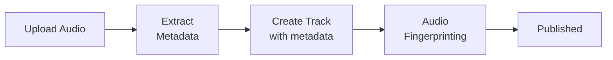

## Overview

The Content Management API provides full CRUD operations for all content types on BeatPass — tracks, albums, artists, playlists, lyrics, and supporting features like audio fingerprinting, Audio Recon, and cover art generation.

<Info>
  **Base URL:** `https://open.beatpass.ca/api/v1`

  **Authentication:** Read operations use optional auth (enhanced data when logged in). Write operations require authentication.
</Info>

---

## Tracks

### List Tracks

```http
GET /api/v1/tracks
```

<Note>
  Public endpoint. Returns enhanced data (purchase status, like status) when authenticated.
</Note>

### Get Track

```http
GET /api/v1/tracks/{track}
```

### Create Track

Upload a new track. Requires authentication.

```http
POST /api/v1/tracks
```

### Update Track

```http
PUT /api/v1/tracks/{track}
```

### Delete Track(s)

```http
DELETE /api/v1/tracks/{ids}
```

<ParamField path="ids" type="string" required>
  Comma-separated track IDs to delete.
</ParamField>

### Download Track

```http
GET /api/v1/tracks/{track}/download
```

### Get Waveform Data

```http
GET /api/v1/tracks/{track}/wave
```

### Batch Waveform Data

```http
POST /api/v1/tracks/wave-batch
```

### Extract Metadata

Extract metadata from an uploaded audio file entry.

```http
POST /api/v1/tracks/{fileEntry}/extract-metadata
```

### Log Track Play

Record a play event for a track.

```http
POST /api/v1/tracks/{track}/plays
```

### Update Play Duration

Update the listen duration of an active playback.

```http
POST /api/v1/tracks/plays/{track}/update-duration
```

### Get Engagement Metrics

```http
GET /api/v1/tracks/{track}/engagement-metrics
```

### Get Producer Analytics

```http
GET /api/v1/tracks/{track}/producer-analytics
```

---

## Track Upload Flow

<Steps>
  <Step title="Upload Audio File">
    Upload the audio file via the file upload system to get a `fileEntry` ID.
  </Step>
  <Step title="Extract Metadata">
    Call `POST /tracks/{fileEntry}/extract-metadata` to parse BPM, key, duration, etc.
  </Step>
  <Step title="Create Track">
    Call `POST /tracks` with metadata (title, genre, tags, BPM, etc.) and the file entry reference.
  </Step>
  <Step title="Audio Fingerprinting">
    The system automatically generates an audio fingerprint for duplicate detection.
  </Step>
  <Step title="Published">
    Track is published and available on the platform.
  </Step>
</Steps>



---

## Albums

### List Albums

```http
GET /api/v1/albums
```

### Get Album

```http
GET /api/v1/albums/{album}
```

### Create Album

```http
POST /api/v1/albums
```

### Update Album

```http
PUT /api/v1/albums/{album}
```

### Delete Album(s)

```http
DELETE /api/v1/albums/{ids}
```

### Album Producer Analytics

```http
GET /api/v1/albums/{album}/producer-analytics
```

---

## Artists

### List Artists

```http
GET /api/v1/artists
```

### Get Artist

```http
GET /api/v1/artists/{artist}
```

### Get Artist's Tracks

```http
GET /api/v1/artists/{artist}/tracks
```

### Get Artist's Albums

```http
GET /api/v1/artists/{artist}/albums
```

### Producer Analytics

```http
GET /api/v1/artists/{artist}/producer-analytics
```

### Downloads Analytics

```http
GET /api/v1/artists/{artist}/downloads-analytics
```

### Producer Achievements

```http
GET /api/v1/artists/{artist}/producer-achievements
```

### Check Ownership

Check if the authenticated user owns this artist profile.

```http
GET /api/v1/artists/{artist}/check-ownership
```

---

## Artist Credits

Professional portfolio credits (similar to Spotify credits). Allows artists to showcase their work on external releases.

### List Credits

```http
GET /api/v1/artists/{artist}/credits
```

### Add Credit

```http
POST /api/v1/artists/{artist}/credits
```

### Add Album Credit

```http
POST /api/v1/artists/{artist}/credits/album
```

### Update Credit

```http
PUT /api/v1/artists/{artist}/credits/{credit}
```

### Delete Credit

```http
DELETE /api/v1/artists/{artist}/credits/{credit}
```

### Reorder Credits

```http
POST /api/v1/artists/{artist}/credits/reorder
```

### Spotify Search (for Credits)

Search Spotify catalog to link credits to releases.

```http
GET /api/v1/credits/spotify-search
```

### Get Spotify Album

```http
GET /api/v1/credits/spotify-album
```

### Credit Roles (Public)

Get the list of available credit roles (e.g., Producer, Engineer, Songwriter).

```http
GET /api/v1/credits/roles
```

---

## Track Pinning

Pin a featured track to the top of an artist's profile.

### Pin Track

```http
POST /api/v1/artists/{artistId}/tracks/{trackId}/pin
```

### Unpin Track

```http
POST /api/v1/artists/{artistId}/tracks/{trackId}/unpin
```

### Get Pinned Track

```http
GET /api/v1/artists/{artistId}/pinned-track
```

---

## Playlists

### List Playlists

```http
GET /api/v1/playlists
```

### Get Playlist

```http
GET /api/v1/playlists/{id}
```

### Create Playlist

```http
POST /api/v1/playlists
```

### Update Playlist

```http
PUT /api/v1/playlists/{playlist}
```

### Delete Playlist(s)

```http
DELETE /api/v1/playlists/{ids}
```

### Follow Playlist

```http
POST /api/v1/playlists/{id}/follow
```

### Unfollow Playlist

```http
POST /api/v1/playlists/{id}/unfollow
```

### Get Playlist Tracks

```http
GET /api/v1/playlists/{id}/tracks
```

### Add Tracks

```http
POST /api/v1/playlists/{playlist}/tracks/add
```

### Remove Tracks

```http
POST /api/v1/playlists/{playlist}/tracks/remove
```

### Reorder Tracks

```http
POST /api/v1/playlists/{playlist}/tracks/order
```

---

## Playlist Collaboration

### Invite Collaborator

```http
POST /api/v1/playlists/{playlist}/invite
```

### Accept Invitation

```http
POST /api/v1/playlists/{playlist}/accept-invite
```

### Decline Invitation

```http
POST /api/v1/playlists/{playlist}/decline-invite
```

### Remove Editor

```http
POST /api/v1/playlists/{playlist}/remove-editor
```

<Note>
  Collaborative playlists support up to 10 editors. Invitations expire after 7 days. A 24-hour cooldown applies between re-invites.
</Note>

---

## Lyrics

### List Lyrics

```http
GET /api/v1/lyrics
```

### Get Track Lyrics

```http
GET /api/v1/tracks/{id}/lyrics
```

### Create Lyrics

```http
POST /api/v1/lyrics
```

### Update Lyrics

```http
PUT /api/v1/lyrics/{id}
```

### Delete Lyrics

```http
DELETE /api/v1/lyrics/{ids}
```

---

## Audio Fingerprinting

Detect duplicate audio content using acoustic fingerprints.

### Generate Fingerprint

```http
POST /api/v1/tracks/{track}/fingerprint
```

### Check Fingerprint Status

```http
GET /api/v1/tracks/{track}/fingerprint/status
```

### Check Duplicates

Check uploaded audio against existing fingerprints.

```http
POST /api/v1/tracks/check-duplicates
```

### Retry Failed Fingerprint

```http
POST /api/v1/fingerprints/{fingerprint}/retry
```

---

## Audio Recon

Audio Recon detects songs on streaming platforms (Spotify, YouTube, Deezer) that share audio characteristics with tracks on BeatPass. Results are available to the track's credited producers and admins.

### Get Audio Recon Matches

Retrieve detected audio similarities for a specific track. Requires authentication. Only accessible by producers credited on the track.

```http
GET /api/v1/tracks/{track}/placements
```

<ParamField path="track" type="integer" required>
  The track ID to retrieve Audio Recon matches for.
</ParamField>

**Response:**

```json
{
  "placements": [
    {
      "id": 42,
      "title": "Song Title",
      "artist_name": "Artist Name",
      "album_name": "Album Name",
      "release_date": "2025-06-15",
      "confidence_score": 95,
      "spotify_url": "https://open.spotify.com/track/...",
      "youtube_url": "https://youtube.com/watch?v=...",
      "deezer_url": "https://deezer.com/track/...",
      "created_at": "2026-02-20T12:00:00+00:00"
    }
  ],
  "total_count": 1,
  "artist_verified": true
}
```

<ResponseField name="placements" type="array">
  Array of detected audio similarities, sorted by confidence score (highest first).
</ResponseField>

<ResponseField name="placements[].confidence_score" type="integer">
  Audio similarity percentage (90–100). Higher scores indicate stronger matches.
</ResponseField>

<ResponseField name="placements[].spotify_url" type="string | null">
  Direct link to the matched song on Spotify, if available.
</ResponseField>

<ResponseField name="placements[].youtube_url" type="string | null">
  Direct link to the matched song on YouTube, if available.
</ResponseField>

<ResponseField name="placements[].deezer_url" type="string | null">
  Direct link to the matched song on Deezer, if available.
</ResponseField>

<ResponseField name="total_count" type="integer">
  Total number of matches returned.
</ResponseField>

<ResponseField name="artist_verified" type="boolean">
  Whether the track's primary artist has a verified profile. Scanning requires a verified artist.
</ResponseField>

<Warning>
  Audio Recon detects audio **similarity**, not confirmed placements. A match could indicate your beat was used, a shared sample, or coincidence. Always verify by listening.
</Warning>

| Error | Code | Cause |
|-------|------|-------|
| Unauthenticated | 401 | No valid Bearer token provided |
| Forbidden | 403 | You are not a credited producer on this track |
| Not Found | 404 | Track does not exist |

---

## Cover Art

### List Templates

```http
GET /api/v1/cover-art/templates
```

### Get Template

```http
GET /api/v1/cover-art/templates/{template}
```

### Preview Cover Art

Generate a preview with a template and custom parameters.

```http
POST /api/v1/cover-art/preview
```

### Get Matching Templates

Get templates that match specific criteria (genre, mood, etc.).

```http
GET /api/v1/cover-art/matching-templates
```

---

## Related Resources

<CardGroup cols={2}>
  <Card title="Commerce & Licensing" icon="cart-shopping" href="/developers/api-reference/commerce">
    Purchase flow and license certificates for tracks.
  </Card>
  <Card title="Search & Discovery" icon="magnifying-glass" href="/developers/api-reference/search">
    Search, genres, tags, and radio recommendations.
  </Card>
</CardGroup>
