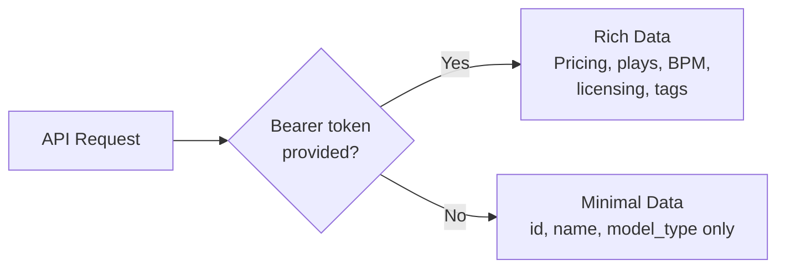
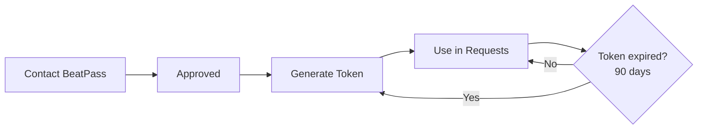

import ApiInviteOnly from "/snippets/warnings/api-invite-only.mdx";
import BearerAuthExample from "/snippets/developer/bearer-auth-example.mdx";

## Overview

The BeatPass API supports **<Tooltip tip="A personal access token included in the Authorization header. Expires after 90 days.">Bearer token</Tooltip> authentication** for approved developer integrations.

<ApiInviteOnly />

---

## Authentication Method

All authenticated API requests use **Bearer tokens** in the `Authorization` header:

<BearerAuthExample />

<CardGroup cols={2}>
  <Card title="Bearer Tokens" icon="key" color="#8b5cf6">
    Personal access tokens for approved developer integrations
  </Card>
  <Card title="Token Expiration" icon="clock" color="#3b82f6">
    Tokens expire after 90 days and must be regenerated
  </Card>
</CardGroup>

---

## Authentication Errors

<AccordionGroup>
  <Accordion title="401 Unauthenticated" icon="circle-xmark">
    <Badge color="red"><Tooltip tip="The server could not verify your identity. Usually means the token is missing, invalid, or expired.">401</Tooltip></Badge> Token missing, invalid, or expired.
    
    **Solution:** Verify your token is correct and has not expired. Contact support if you need a new token.
    
    ```json
    { "message": "Unauthenticated." }
    ```
  </Accordion>
  
  <Accordion title="403 Forbidden" icon="ban">
    <Badge color="orange"><Tooltip tip="You authenticated successfully, but your account lacks permission to access this specific resource.">403</Tooltip></Badge> Your account lacks permission for this resource.
    
    **Solution:** Ensure your account has been granted API access. Contact support if you believe this is an error.
  </Accordion>
</AccordionGroup>

---

## API Access Tiers

The BeatPass API uses a **two-tier access model** for external consumers:

| Tier | Auth Method | Data Level | Use Case |
|------|-------------|------------|----------|
| **Public** | None | Minimal (id, name, model_type only) | Basic resource identification |
| **Token** | `Authorization: Bearer {token}` | Rich (pricing, plays, BPM, licensing) | Approved developer integrations |

<Warning>
  **Unauthenticated API requests return minimal data by design.** To receive rich responses with pricing, play counts, licensing info, and more, you must authenticate with a Bearer token. This protects the platform catalog from scraping.
</Warning>

### What Each Tier Returns

<Tabs>
  <Tab title="Public (No Token)">
    **Track:** `id`, `name`, `image`, `created_at`, `model_type`, `duration_text`
    
    **Artist:** `id`, `name`, `model_type`
    
    **Genre:** `id`, `name`, `display_name`, `model_type`
    
    **Album:** `id`, `name`, `model_type`, `image`, `release_date`
    
    No pricing, play counts, BPM, key/scale, licensing, or internal fields.
  </Tab>
  <Tab title="Token (Bearer Auth)">
    Everything in Public, plus:
    
    **Track:** `duration`, `price`, `currency`, `bpm`, `key`, `scale`, `plays`, `licensing_type`, `exclusive_status`, `exclusive_price`, `reposts_count`, `likes_count`, `description`, `tags`, and more.
    
    **Artist:** `bio`, `website`, `verified`, and profile data.
    
    **Album:** `plays`, `created_at`, `tracks` relation.
    
    Sensitive fields remain hidden: `src` (audio URL), `exclusive_license_config`, `owner_id`, `sample_safe_*`, `cover_art_*`.
  </Tab>
</Tabs>



---

## Requesting API Access

API access is granted on a **case-by-case basis** to approved developers and partners.

<Steps>
  <Step title="Contact BeatPass">
    Email [**contact@beatpass.ca**](mailto:contact@beatpass.ca) with your use case, expected request volume, and organization details.
  </Step>
  
  <Step title="Review & Approval">
    The BeatPass team will review your request. Approved developers will receive API access on their account.
  </Step>
  
  <Step title="Generate Token">
    Once approved, navigate to **Account Settings → Developers** and click **Create** to generate your token. Copy it immediately — it is only shown once.
  </Step>
  
  <Step title="Authenticate Requests">
    Include the token in the `Authorization` header of all API requests:
    ```http
    Authorization: Bearer {your-token}
    ```
  </Step>
</Steps>



### Token Details

| Property | Value |
|----------|-------|
| **Access** | Invite-only, granted by BeatPass team |
| **Expiration** | 90 days from creation |
| **Header format** | `Authorization: Bearer {token}` |

<Warning>
  Treat your API token like a password. Do not share it, commit it to version control, or expose it in client-side code. Misuse of API tokens will result in immediate revocation and potential account termination.
</Warning>

### Revoking Tokens

To revoke a token, return to **Account Settings → Developers** and click **Delete** next to the token.

---

## Security

<AccordionGroup>
  <Accordion title="HTTPS Only">
    All API requests must use HTTPS. Non-secure requests are rejected.
  </Accordion>
  
  <Accordion title="Token Security">
    Never expose tokens in client-side code, URLs, or public repositories.
  </Accordion>
  
  <Accordion title="Abuse Monitoring">
    All API activity is logged and monitored. Abusive patterns (scraping, excessive requests, unauthorized access attempts) result in immediate token revocation and account termination.
  </Accordion>
</AccordionGroup>

---

## Next Steps

<CardGroup cols={2}>
  <Card title="API Reference" icon="code" href="/developers/api-reference/overview">
    See available endpoints.
  </Card>
  <Card title="Rate Limits" icon="gauge" href="/developers/rate-limits">
    Understand request limits.
  </Card>
</CardGroup>
