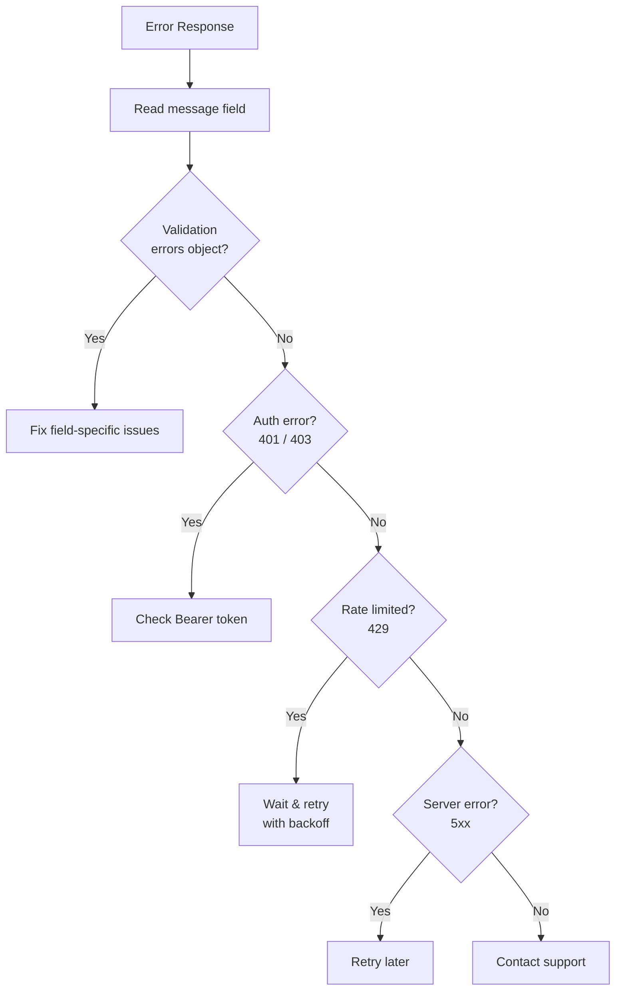

## Overview

This catalog documents common errors you may encounter across BeatPass API endpoints, along with their meanings and suggested resolutions.

---

## Error Response Format

All errors follow this structure:

```json
{
  "message": "Human-readable error description",
  "errors": {
    "field_name": ["Specific validation error"]
  }
}
```

---

## HTTP Status Codes

<CardGroup cols={4}>
  <Card title="400" icon="circle-exclamation" color="#f59e0b">
    **Bad Request** Malformed syntax
  </Card>
  <Card title="401" icon="lock" color="#ef4444">
    **Unauthorized** Auth required
  </Card>
  <Card title="403" icon="ban" color="#dc2626">
    **Forbidden** Not permitted
  </Card>
  <Card title="404" icon="magnifying-glass" color="#6b7280">
    **Not Found** Doesn't exist
  </Card>
  <Card title="409" icon="arrows-split-up-and-left" color="#8b5cf6">
    **Conflict** State conflict
  </Card>
  <Card title="422" icon="file-circle-xmark" color="#f97316">
    **Unprocessable** Validation failed
  </Card>
  <Card title="429" icon="gauge-high" color="#eab308">
    **Too Many** Rate limited
  </Card>
  <Card title="500" icon="server" color="#991b1b">
    **Server Error** Internal issue
  </Card>
</CardGroup>

---

## Authentication Errors

<AccordionGroup>
  <Accordion title="Invalid credentials" defaultOpen icon="key">
    <Badge color="red">401</Badge>
     Wrong email or password combination.

    **Resolution:** Verify your credentials. Use "Forgot Password" if needed.
  </Accordion>
  <Accordion title="Account disabled" icon="user-slash">
    <Badge color="red">403</Badge>
     Account has been suspended.

    **Resolution:** Contact [contact@beatpass.ca](mailto:contact@beatpass.ca) for assistance.
  </Accordion>
  <Accordion title="Email not verified" icon="envelope">
    <Badge color="orange">403</Badge>
     Email verification is pending.

    **Resolution:** Check your inbox for the verification link. Request a new one if needed.
  </Accordion>
  <Accordion title="Token expired" icon="clock">
    <Badge color="gray">401</Badge>
     Your authentication token has expired.

    **Resolution:** Generate a new token from **Account Settings → Developers**.
  </Accordion>
  <Accordion title="Unauthenticated" icon="lock">
    <Badge color="red">401</Badge>
     No valid authentication token found.

    **Resolution:** Include a valid Bearer token in your request. Contact support if your token has expired.
  </Accordion>
</AccordionGroup>

---

## Track & Upload Errors

<Tabs>
  <Tab title="Upload Validation">
    <AccordionGroup>
      <Accordion title="File too large" icon="file-arrow-up">
        <Badge color="orange">422</Badge>
         File exceeds maximum size (256 MB).

        **Resolution:** Compress or reduce file size before uploading.
      </Accordion>
      <Accordion title="Invalid file format" icon="file-audio">
        <Badge color="orange">422</Badge>
         Unsupported audio format.

        **Resolution:** Use WAV, FLAC, or AIFF. MP3 files are not accepted.
      </Accordion>
      <Accordion title="Duration issues" icon="clock">
        <Badge color="orange">422</Badge>
         Track duration must be at least 1 second.

        **Resolution:** Ensure the uploaded file has a valid duration.
      </Accordion>
      <Accordion title="Missing required fields" icon="keyboard">
        <Badge color="orange">422</Badge>
         Title, BPM, or Genre not provided.

        **Resolution:** Fill in all required metadata fields.
      </Accordion>
    </AccordionGroup>
  </Tab>
  <Tab title="Processing">
    <AccordionGroup>
      <Accordion title="Transcode failed" icon="rotate-exclamation">
        <Badge color="red">500</Badge>
         Audio processing encountered an error.

        **Resolution:** Re-export from your DAW and upload again.
      </Accordion>
      <Accordion title="Fingerprint collision" icon="fingerprint">
        <Badge color="purple">409</Badge>
         Duplicate audio detected.

        **Resolution:** This track may already exist on the platform.
      </Accordion>
      <Accordion title="Processing timeout" icon="hourglass-end">
        <Badge color="gray">504</Badge>
         File took too long to process.

        **Resolution:** Try a smaller file or retry later.
      </Accordion>
    </AccordionGroup>
  </Tab>
  <Tab title="Access">
    <AccordionGroup>
      <Accordion title="Track not found" icon="magnifying-glass">
        <Badge color="gray">404</Badge>
         Track ID doesn't exist or was deleted.

        **Resolution:** Verify the track ID is correct.
      </Accordion>
      <Accordion title="Track unavailable" icon="circle-xmark">
        <Badge color="gray">410</Badge>
         Removed by owner or moderation.

        **Resolution:** This track is no longer accessible.
      </Accordion>
      <Accordion title="Private track" icon="lock">
        <Badge color="orange">403</Badge>
         Track is not published.

        **Resolution:** Only the owner can access unpublished tracks.
      </Accordion>
    </AccordionGroup>
  </Tab>
</Tabs>

---

## Purchase & Licensing Errors

### Purchase Flow

| Error                      | Code | Cause                         | Resolution             |
| -------------------------- | ---- | ----------------------------- | ---------------------- |
| `Track not for sale`       | 400  | No license configured         | Contact producer       |
| `Already purchased`        | 409  | User already owns license     | Check purchases        |
| `Exclusive already sold`   | 410  | Exclusive no longer available | Track sold exclusively |
| `Price changed`            | 409  | Price updated since page load | Refresh and retry      |
| `Checkout expired`         | 400  | Took too long to complete     | Start new checkout     |

### Payment Errors

| Error                | Code | Cause                       | Resolution                   |
| -------------------- | ---- | --------------------------- | ---------------------------- |
| `Payment failed`     | 402  | Card declined               | Try different payment method |
| `Card declined`      | 402  | Issuer declined transaction | Contact card issuer          |
| `Insufficient funds` | 402  | Not enough balance          | Use different card           |
| `Invalid card`       | 422  | Card number invalid         | Check card details           |
| `Expired card`       | 422  | Card past expiration        | Update card info             |
| `Processing error`   | 500  | Stripe communication issue  | Retry in a moment            |

### License Errors

| Error               | Code | Cause                   | Resolution            |
| ------------------- | ---- | ----------------------- | --------------------- |
| `License not found` | 404  | Invalid license ID      | Verify license ID     |
| `License revoked`   | 410  | License was revoked     | Contact support       |
| `Download expired`  | 403  | Download link timed out | Get new download link |

---

## Beat Request Errors

### Creation

| Error                        | Code | Cause                                    | Resolution                          |
| ---------------------------- | ---- | ---------------------------------------- | ----------------------------------- |
| `No tokens remaining`        | 429  | Monthly token allowance exhausted        | Wait for monthly reset or upgrade   |
| `Insufficient tokens`        | 429  | Not enough tokens for chosen duration    | Choose a shorter duration or wait   |
| `Description too short`      | 422  | Under minimum length (10 characters)     | Add more detail                     |
| `Reference track required`   | 422  | Missing reference track URL              | Provide a valid URL                 |
| `Invalid reference track`    | 422  | URL format invalid                       | Provide a valid YouTube, Spotify, or SoundCloud link |

### Submission

| Error                        | Code | Cause                                    | Resolution                          |
| ---------------------------- | ---- | ---------------------------------------- | ----------------------------------- |
| `Request not found`          | 404  | Invalid request ID                       | Verify ID                           |
| `Request expired`            | 410  | Duration window (24/48/72h) has closed   | Find an active request              |
| `Duplicate submission`       | 409  | Same track already submitted             | Choose a different track            |
| `Submission limit reached`   | 422  | Producer already submitted 5 tracks      | Maximum tracks per request reached  |
| `Duplicate audio detected`   | 409  | Audio fingerprint matches existing submission | Try a different track          |
| `Track not platform-hosted`  | 422  | Track is an external link, not uploaded  | Upload the track to the platform first |
| `Fingerprint not completed`  | 422  | Track hasn't finished audio processing   | Wait for processing to complete     |
| `Not track owner`            | 403  | Producer doesn't own or collaborate on track | Submit only your own tracks     |
| `Self-submission blocked`    | 403  | Cannot submit to your own request        | Find another user's request         |

### Deletion & Renewal

| Error                        | Code | Cause                                    | Resolution                          |
| ---------------------------- | ---- | ---------------------------------------- | ----------------------------------- |
| `Not request owner`          | 403  | Only the creator can delete or renew     | Verify ownership                    |
| `Request still active`       | 409  | Cannot renew a request that hasn't expired | Wait for expiration or delete     |
| `Renewal window expired`     | 410  | Request expired more than 30 days ago    | Create a new request instead        |
| `No token for renewal`       | 429  | No tokens available to renew             | Wait for monthly reset or upgrade   |

---

## Messaging Errors

### Sending Messages

| Error                 | Code | Cause                    | Resolution               |
| --------------------- | ---- | ------------------------ | ------------------------ |
| `Recipient not found` | 404  | Invalid user ID          | Verify recipient         |
| `User blocked you`    | 403  | Recipient blocked sender | Cannot message this user |
| `You blocked user`    | 403  | Sender blocked recipient | Unblock to message       |
| `Message too long`    | 422  | Message exceeds limit    | Shorten message          |
| `Rate limited`        | 429  | Too many messages        | Wait before sending more |

### Conversation

| Error                    | Code | Cause                    | Resolution    |
| ------------------------ | ---- | ------------------------ | ------------- |
| `Conversation not found` | 404  | Invalid conversation ID  | Verify ID     |
| `Not a participant`      | 403  | User not in conversation | Cannot access |

---

## Collection & Library Errors

### Saves & Playlists

| Error                       | Code | Cause                         | Resolution              |
| --------------------------- | ---- | ----------------------------- | ----------------------- |
| `Library full`              | 429  | Maximum saved items reached   | Remove old items        |
| `Playlist full`             | 429  | Maximum tracks per playlist   | Create new playlist     |
| `Playlist limit reached`    | 429  | Maximum playlists reached     | Delete unused playlists |
| `Track already saved`       | 409  | Already in library            | No action needed        |
| `Track already in playlist` | 409  | Duplicate in playlist         | Track exists            |

### Collaborative Playlists

| Error                  | Code | Cause                     | Resolution          |
| ---------------------- | ---- | ------------------------- | ------------------- |
| `Max editors reached`  | 429  | Maximum collaborators     | Remove editor first |
| `Invitation expired`   | 410  | Invitation expired        | Send new invitation |
| `Already invited`      | 409  | Pending invitation exists | Wait for response   |
| `Cannot re-invite yet` | 429  | Cooldown period active    | Wait to re-invite   |

---

## Social & Following Errors

### Following

| Error                  | Code | Cause                            | Resolution                 |
| ---------------------- | ---- | -------------------------------- | -------------------------- |
| `Already following`    | 409  | Already followed                 | No action needed           |
| `Not following`        | 404  | Cannot unfollow if not following | Check following status     |
| `Follow limit reached` | 429  | Maximum following reached        | Unfollow some accounts     |
| `Follow rate limited`  | 429  | Too many follows                 | Wait before following more |

### Reposts

| Error                     | Code | Cause                   | Resolution           |
| ------------------------- | ---- | ----------------------- | -------------------- |
| `Already reposted`        | 409  | Track already reposted  | No action needed     |
| `Repost limit reached`    | 429  | Repost limit exceeded   | Wait for limit reset |
| `Cannot repost own track` | 400  | Self-repost not allowed | N/A                  |

---

## Radio Errors

| Error                     | Code | Cause                       | Resolution           |
| ------------------------- | ---- | --------------------------- | -------------------- |
| `Skip limit reached`      | 429  | Skip limit exceeded         | Wait for reset       |
| `Station not found`       | 404  | Invalid station             | Choose valid station |
| `Concurrent stream limit` | 429  | Already streaming elsewhere | Stop other stream    |

---

## Rate Limiting

### Rate Limit Response

```json
{
  "message": "Too Many Attempts.",
  "retry_after": 60
}
```

### Rate Limit Headers

```http
X-RateLimit-Limit: 60
X-RateLimit-Remaining: 0
X-RateLimit-Reset: 1700000060
Retry-After: 60
```

### Handling Rate Limits

<CardGroup cols={2}>
  <Card title="Exponential Backoff" icon="clock-rotate-left" color="#3b82f6">
    Wait, then double the delay on each retry attempt.
  </Card>
  <Card title="Check Headers" icon="code" color="#22c55e">
    Monitor `X-RateLimit-Remaining` before making requests.
  </Card>
  <Card title="Queue Requests" icon="list-check" color="#f59e0b">
    Space out API calls to stay under limits.
  </Card>
  <Card title="Cache Responses" icon="database" color="#8b5cf6">
    Reduce redundant calls by caching data locally.
  </Card>
</CardGroup>

---

## Server Errors (5xx)

<AccordionGroup>
  <Accordion title="500 - Internal Server Error" defaultOpen icon="server">
    <Badge color="red">500</Badge>
     An unexpected server-side issue occurred.

    **Resolution:** Retry the request. If persistent, contact support with the timestamp and endpoint.
  </Accordion>
  <Accordion title="503 - Service Unavailable" icon="power-off">
    <Badge color="orange">503</Badge>
     Platform is undergoing maintenance.

    **Resolution:** Check the [status page](https://status.beatpass.ca) for updates.
  </Accordion>
  <Accordion title="504 - Gateway Timeout" icon="hourglass-clock">
    <Badge color="gray">504</Badge>
     Request took too long to process.

    **Resolution:** Retry with a smaller payload or try again later.
  </Accordion>
</AccordionGroup>

<Tip>
  Server errors (5xx) are logged automatically. If you encounter persistent issues, contact support with the approximate time and endpoint details.
</Tip>

---

## Troubleshooting Checklist

<Steps>
  <Step title="Check Error Message">
    Read the `message` field for human-readable explanation.
  </Step>
  <Step title="Check Validation Errors">
    Review `errors` object for field-specific issues.
  </Step>
  <Step title="Verify Authentication">
    Ensure your Bearer token is valid and included in the `Authorization` header.
  </Step>
  <Step title="Check Rate Limits">
    Review `X-RateLimit-*` headers.
  </Step>
  <Step title="Retry with Backoff">
    For transient errors, wait and retry.
  </Step>
  <Step title="Contact Support">
    For persistent issues, provide error details and timestamps.
  </Step>
</Steps>



---

## Related Resources

<CardGroup cols={2}>
  <Card title="API Overview" icon="book" href="/developers/overview">
    API fundamentals.
  </Card>
  <Card title="Rate Limits" icon="gauge" href="/developers/rate-limits">
    Throttling details.
  </Card>
</CardGroup>