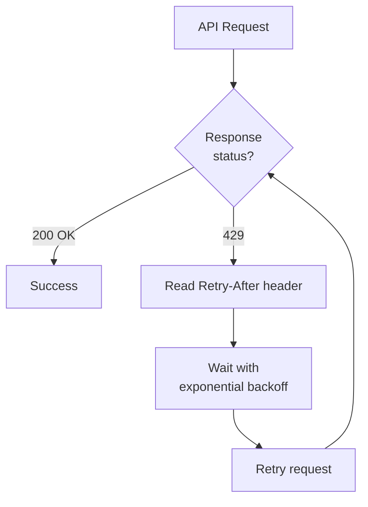

## Overview

The BeatPass API enforces <Tooltip tip="A cap on how many API requests you can make within a time window to prevent abuse and ensure fair access.">rate limits</Tooltip> to ensure fair usage and platform stability. Different endpoint categories have different limits based on their resource intensity.

---

## Global Rate Limit

<Card title="Global API Limit" icon="gauge-high" color="#ef4444">
  <Badge color="red" size="lg">300 requests/minute</Badge>
  All API endpoints are subject to a global rate limit of 300 requests per minute per client. Route-specific limits below may impose stricter thresholds on individual endpoints.
</Card>

---

## Rate Limit Categories

Different endpoint categories have different rate limits. The API applies the most restrictive applicable limit.

<AccordionGroup>
  <Accordion title="General API Endpoints" defaultOpen icon="globe">
    Standard content endpoints (tracks, artists, albums, search, genres) are subject to the global rate limit.
  </Accordion>
  <Accordion title="Media Endpoints" icon="headphones">
    Audio and image endpoints have stricter per-minute limits to prevent abuse.
  </Accordion>
  <Accordion title="Analytics Endpoints" icon="chart-mixed">
    Analytics and dashboard endpoints have dedicated rate limits appropriate for their resource intensity.
  </Accordion>
  <Accordion title="Write Operations" icon="pen">
    Endpoints that create or modify data (uploads, purchases, messages) have stricter limits.
  </Accordion>
</AccordionGroup>

<Note>
  Authentication endpoints have strict rate limits to prevent brute-force attacks. Excessive failed attempts will result in temporary lockout.
</Note>

---

## Rate Limit Format

Rate limits are expressed as requests per time window:

- **Requests:** Maximum number of requests allowed
- **Window:** Time period (typically 1 minute)

Example: "60 requests per minute" means you can make 60 requests within any 60-second window.

---

## Rate Limit Headers

Responses include standard rate limit headers:

```http
X-RateLimit-Limit: 300
X-RateLimit-Remaining: 298
X-RateLimit-Reset: 1700000060
```

<ResponseField name="X-RateLimit-Limit" type="integer">
  Maximum requests allowed in the current window.
</ResponseField>

<ResponseField name="X-RateLimit-Remaining" type="integer">
  Number of requests remaining in the current window.
</ResponseField>

<ResponseField name="X-RateLimit-Reset" type="unix timestamp">
  Unix timestamp when the rate limit window resets.
</ResponseField>

---

## When Limits Are Exceeded

### <Tooltip tip="An HTTP status code meaning you've exceeded the allowed request rate. Wait for the Retry-After duration before retrying.">429</Tooltip> Response

```http
HTTP/1.1 429 Too Many Requests
Retry-After: 60
```

```json
{
  "message": "Too Many Attempts.",
  "retry_after": 60
}
```

### Handling Rate Limits

<Steps>
  <Step title="Stop Requests">
    Immediately pause further requests to the limited endpoint.
  </Step>
  <Step title="Check Retry-After">
    Read the <Tooltip tip="An HTTP response header telling you how many seconds to wait before making another request.">`Retry-After`</Tooltip> header for wait duration.
  </Step>
  <Step title="Implement Backoff">
    Use exponential backoff for retries.
  </Step>
  <Step title="Resume Carefully">
    Resume with reduced frequency.
  </Step>
</Steps>



---

## Best Practices

### Optimize Request Patterns

<AccordionGroup>
  <Accordion title="Use Batch Endpoints">
    Where available, use batch endpoints to fetch multiple resources in a single request instead of individual calls.
  </Accordion>
  <Accordion title="Cache Responses">
    Cache API responses locally to reduce redundant calls. Most data does not change frequently.
  </Accordion>
  <Accordion title="Paginate Efficiently">
    Request appropriate page sizes. Don't fetch more data than needed.
  </Accordion>
  <Accordion title="Debounce User Input">
    For search-as-you-type features, debounce input by 300ms+ before triggering API calls.
  </Accordion>
</AccordionGroup>

### <Tooltip tip="A retry strategy that doubles the wait time after each failed attempt, preventing further rate-limit hits.">Exponential Backoff</Tooltip>

```javascript
async function fetchWithBackoff(url, options = {}, attempt = 1) {
  const maxAttempts = 5;
  
  const response = await fetch(url, options);
  
  if (response.status === 429 && attempt < maxAttempts) {
    const retryAfter = parseInt(response.headers.get('Retry-After')) || Math.pow(2, attempt);
    await new Promise(resolve => setTimeout(resolve, retryAfter * 1000));
    return fetchWithBackoff(url, options, attempt + 1);
  }
  
  return response;
}
```

---

## Monitoring Usage

### Track Rate Limit Status

```javascript
async function apiRequest(url, options) {
  const response = await fetch(url, options);
  
  const remaining = response.headers.get('X-RateLimit-Remaining');
  const limit = response.headers.get('X-RateLimit-Limit');
  
  if (remaining && parseInt(remaining) < 10) {
    console.warn(`Rate limit warning: ${remaining}/${limit} remaining`);
  }
  
  return response;
}
```

### Common Patterns That Trigger Limits

<AccordionGroup>
  <Accordion title="Polling too frequently" icon="rotate">
    **Problem:** High frequency polling drains your quota.

    **Solution:** Use reasonable intervals (30+ seconds) and cache responses locally.
  </Accordion>
  <Accordion title="Individual resource calls in loops" icon="chart-simple">
    **Problem:** Fetching resources one at a time in a loop.

    **Solution:** Use batch endpoints where available, or paginated listing endpoints.
  </Accordion>
  <Accordion title="Multiple concurrent requests" icon="arrows-split-up-and-left">
    **Problem:** Firing many requests simultaneously.

    **Solution:** Stagger requests and use combined endpoints where available.
  </Accordion>
</AccordionGroup>

---

## Error Recovery

When you hit a rate limit:

1. **Don't retry immediately** — This wastes your remaining quota
2. **Check the `Retry-After` header** — Wait the specified duration
3. **Review access patterns** — Identify optimization opportunities
4. **Contact support** — If legitimate usage requires higher limits

---

## Next Steps

<CardGroup cols={2}>
  <Card title="API Reference" icon="code" href="/developers/api-reference/overview">
    See all available endpoints.
  </Card>
  <Card title="Authentication" icon="key" href="/developers/auth">
    Understand API authentication.
  </Card>
</CardGroup>