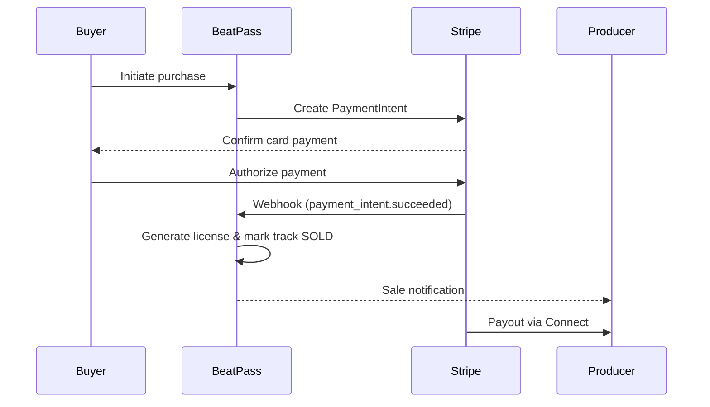

## Overview

BeatPass processes payment events from Stripe via <Tooltip tip="An automated HTTP callback that Stripe sends to BeatPass when a payment event occurs (e.g. payment succeeded, payout deposited).">webhooks</Tooltip>. There is currently no outbound webhook system for external developer integrations.

<Note>
  BeatPass does not send webhooks to external applications. This page provides an overview of how payment processing works on the platform.
</Note>

---

## Stripe Events Handled

The webhook controller processes the following Stripe events:

<Tabs>
  <Tab title="Purchase Events">
    <AccordionGroup>
      <Accordion title="payment_intent.succeeded" defaultOpen icon="circle-check">
        A <Tooltip tip="A Stripe object representing a customer's payment lifecycle — from creation through confirmation to completion.">PaymentIntent</Tooltip> succeeded.
        <Badge color="green">Success</Badge>
        Completes the purchase and activates the license.
      </Accordion>
      <Accordion title="payment_intent.payment_failed" icon="circle-xmark">
        <Badge color="red">Failed</Badge>
        Records the payment failure. The buyer sees an error on their next visit.
      </Accordion>
      <Accordion title="charge.refunded" icon="rotate-left">
        <Badge color="orange">Refund</Badge>
        Processes the refund (supports both partial and full refunds).
      </Accordion>
    </AccordionGroup>
  </Tab>
  <Tab title="Payout Events">
    <AccordionGroup>
      <Accordion title="payout.created" defaultOpen icon="clock">
        <Badge color="blue">Initiated</Badge>
        Payout initiated to producer's bank account.
      </Accordion>
      <Accordion title="payout.paid" icon="circle-check">
        <Badge color="green">Deposited</Badge>
        Payout deposited successfully.
      </Accordion>
      <Accordion title="payout.failed" icon="circle-xmark">
        <Badge color="red">Failed</Badge>
        Payout failed. Producer is informed of the reason.
      </Accordion>
    </AccordionGroup>
  </Tab>
  <Tab title="Account Events">
    <Accordion title="account.updated" defaultOpen icon="rotate">
      <Badge color="purple">Sync</Badge>
      Updates <Tooltip tip="Stripe's platform for marketplace payouts, used by BeatPass to route earnings to producers' bank accounts.">Stripe Connect</Tooltip> account status. Producer is informed if action is required (verification, document upload, etc.).
    </Accordion>
  </Tab>
</Tabs>

---

## How It Works

<Steps>
  <Step title="Payment Initiated">
    User initiates a track purchase through the BeatPass checkout flow.
  </Step>
  <Step title="Payment Processed">
    Stripe processes the payment securely.
  </Step>
  <Step title="BeatPass Updated">
    BeatPass automatically:

    - Updates purchase records
    - Generates license certificates for successful purchases
    - Marks tracks as sold for exclusive purchases
    - Sends notifications to producers
  </Step>
</Steps>

---

## Webhook Security

All payment webhooks are cryptographically verified to ensure authenticity. Invalid or tampered requests are rejected automatically. All webhook processing is logged for audit purposes.

---

## No Outbound Webhooks

<Info>
  BeatPass does not currently offer outbound webhooks for external integrations.
</Info>

If you need real-time updates for your integration, contact [**contact@beatpass.ca**](mailto:contact@beatpass.ca) to discuss your use case.

---

## Related Resources

<CardGroup cols={3}>
  <Card title="Commerce & Licensing API" icon="cart-shopping" href="/developers/api-reference/commerce">
    Purchase flow, license certificates, and Stripe Connect endpoints.
  </Card>
  <Card title="Exclusive Licenses" icon="file-certificate" href="/help/downloads-and-licensing/exclusive-licenses">
    How exclusive purchases and licensing work.
  </Card>
  <Card title="Stripe Connect" icon="link" href="/help/earnings/stripe-connect">
    Producer payout setup guide.
  </Card>
</CardGroup>