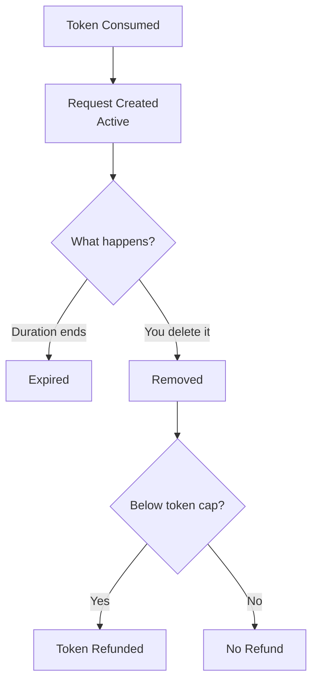

Once you've created beat requests, you can track their status, view submissions, and manage them from your account. This guide covers everything you need to know about managing your requests.

---

## Viewing Your Requests

### Where to Find Them

Access your beat requests through the Beat Requests section. You'll see:
- **Your active requests** — Currently accepting submissions
- **Your expired requests** — Past their expiration window
- **All platform requests** — Browse what others are requesting

### Request Status

Each of your requests shows its current status:

| Status | Meaning |
|--------|---------|
| **Active** | Still accepting submissions (within the chosen duration) |
| **Expired** | No longer accepting submissions |

### Request Details

Click on any request to see:
- Full description and specifications
- Reference track link
- Time remaining (for active requests)
- All submissions received
- Submission count

---

## Tracking Active Requests

### Time Remaining

Active requests show how much time is left:
- **Hours remaining** — Countdown until expiration
- **Human-readable format** — "23 hours from now" or "2 hours left"

### Submission Count

Watch your submission count grow as producers respond:
- The count updates in real time
- Each number represents one track submitted
- Click to view all submissions

<Tip>
  Check your requests periodically during the active window. Early engagement with producers who submit can lead to better connections.
</Tip>

---

## Deleting a Request

### How to Delete

1. Find the request you want to delete
2. Click the delete option (usually a trash icon or "Delete" button)
3. Confirm the deletion

### What Happens When You Delete

- **Request is removed** — No longer visible to producers
- **Token refunded** — You get your token back (if eligible)
- **Existing submissions** — Still accessible if the request had any

### Token Refund Rules

| Situation | Token Refunded? |
|-----------|-----------------|
| Delete active request, below monthly limit | Yes |
| Delete active request, at monthly limit | No |
| Delete expired request | No |

<Warning>
  Deleting a request removes it from the public feed. Producers can no longer submit to it. Make sure you really want to delete before confirming.
</Warning>

### Why Delete a Request?

Common reasons to delete:
- You made a mistake in the specifications
- Your needs changed
- You want to reclaim the token for a different request
- You found what you needed elsewhere
- Renew the request (see renewal details below)

---

## Request History

### Viewing Past Requests

Your request history includes:
- **All requests you've created** — Both active and expired
- **Submissions received** — Tracks sent by producers
- **Request details** — Your original specifications

### Expired Requests

Even after expiration, you can still:
- View the original request details
- See all submissions you received
- Access producer profiles who submitted
- Listen to submitted tracks

<Note>
  Expired requests cannot receive new submissions, but all the data remains accessible for your reference.
</Note>

### Renewing Expired Requests

If a request expires, you have a **30-day renewal window**:

- Look for the **Renew** option on expired requests marked as eligible
- Renewing consumes **1 token** and reactivates the request for another active window (default: 24 hours)
- You can only renew your own requests
- Requests that expired more than 30 days ago can't be renewed—you'll need to create a new one

<Tip>
  If you plan to renew, make sure you have a token available before hitting **Renew**. The token is deducted immediately.
</Tip>

---

## Request Lifecycle Summary

### Key Dates

- **Created** — When you submitted the request
- **Expires** — After the chosen duration (24, 48, or 72 hours)
- **Deleted** — If you removed it manually

---

## My Requests vs. All Requests

### My Requests

Shows only requests **you** created:
- Your active requests
- Your expired requests
- Your submission counts

### All Requests (Browse)

Shows **everyone's** active requests:
- All currently active requests on the platform
- Useful for producers looking for opportunities
- Your own requests may appear here too

---

## Request Statistics

For each request, you can see:

| Metric | Description |
|--------|-------------|
| **Submission count** | Number of beats submitted |
| **Time remaining** | Hours until expiration |
| **Status** | Active or Expired |
| **Created at** | When you posted the request |

---

## Troubleshooting

<AccordionGroup>
  <Accordion title="I can't find my request">
    Check if:
    - It expired (moves from active to history)
    - You accidentally deleted it
    - You're logged into the correct account
  </Accordion>
  
  <Accordion title="My token wasn't refunded after deleting">
    Tokens are only refunded if:
    - The request was still active (not expired)
    - You're below your plan's monthly token limit
    If you're already at max tokens, the refund is skipped.
  </Accordion>
  
  <Accordion title="The submission count seems wrong">
    Submission counts update in real time. If it seems stuck:
    - Refresh the page
    - Wait a few seconds
    - Multiple submissions from the same producer each count separately (if different tracks)
  </Accordion>
  
  <Accordion title="Can I reactivate an expired request?">
    Yes, within 30 days. Look for the **Renew** option on eligible expired requests. Renewing costs 1 token and reactivates the request for another 24-hour window. Requests older than 30 days cannot be renewed — you'll need to create a new one.
  </Accordion>
  
  <Accordion title="Can I edit a request after posting?">
    No. Requests cannot be edited once submitted. If you need to change something, delete the request (get your token back) and create a new one with corrected details.
  </Accordion>
</AccordionGroup>

---

## Best Practices

### During the Active Window

- **Check submissions regularly** — Don't wait until expiration
- **Respond to promising producers** — Start conversations early
- **Don't delete prematurely** — You might get more submissions

### After Expiration

- **Review all submissions** — Some gems might be in later submissions
- **Follow up with producers** — Message anyone whose work you liked
- **Learn for next time** — Note what worked in your request description

### Managing Tokens

- **Plan your requests** — Use tokens strategically
- **Delete unused requests** — Reclaim tokens if you change your mind
- **Monitor your balance** — Know how many requests you can make

---

## Related Topics

<CardGroup cols={2}>
  <Card title="Understanding Tokens" icon="coins" href="/help/beat-requests/understanding-tokens">
    Learn about token refunds when deleting requests.
  </Card>
  <Card title="Receiving Submissions" icon="inbox" href="/help/beat-requests/receiving-submissions">
    How to review and respond to submissions.
  </Card>
</CardGroup>
