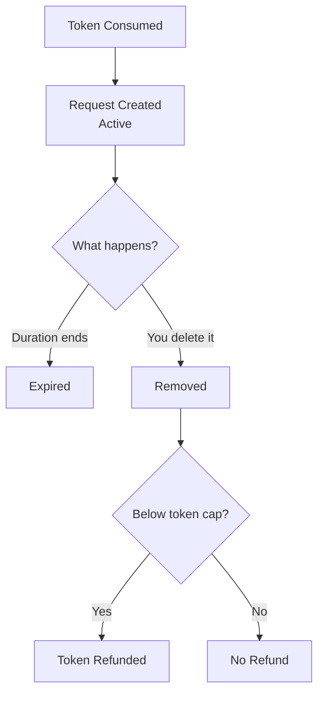

Once you start posting Beat Requests, you need to know where to find them, when they can be renewed, and what happens if you delete one. This page covers the current management flow.

---

## Viewing Your Requests

### Where to Find Them

You can manage requests in two places:

| Location | What You See |
|----------|--------------|
| **Beat Requests** → **My Requests** | Your own requests mixed into the main Beat Requests experience |
| **Library** → **Beat requests** | The dedicated **My Beat Requests** page with separate **Active Requests** and **Expired Requests** sections |

The public **All Requests** tab shows active requests only. Your own request-management views can include expired requests as long as BeatPass still keeps them in the renewal/history window.

### Request Status

Each of your requests shows its current status:

| Status | Meaning |
|--------|---------|
| **Active** | Still accepting submissions (within the chosen duration) |
| **Expired** | No longer accepting submissions |
| **Renewable** | Expired, but still within the 30-day renewal window |

### What You Can See on Each Request Card

Request cards can show:

- Your original description
- Genre, BPM, key, mood, and budget if you added them
- The **Reference** link
- Time remaining for active requests
- Submission count
- **Renew (1 token)** when the request is eligible for renewal

---

## Tracking Active Requests

### Time Remaining

Active requests show how much time is left:
- **Hours remaining** — Countdown until expiration
- **Human-readable format** — "23 hours from now" or "2 hours left"
- **Posted time** — Relative timestamp showing when the request was created (e.g., "5m ago", "2h ago")

### Submission Count

Watch your submission count grow as producers respond:
- Each number represents one submitted track
- Multiple tracks from the same producer still count individually
- Counts appear on both the main request cards and the dedicated **My Beat Requests** page

<Tip>
  If you want the easiest path back to a submitted beat, leave your submission notifications enabled. BeatPass does not currently provide a dedicated request-details submissions inbox.
</Tip>

---

## Deleting a Request

### How to Delete

1. Find the request you want to delete
2. Click the delete option (usually a trash icon or "Delete" button)
3. Confirm the deletion

### What Happens When You Delete

- **Request is removed** — No longer visible to producers
- **Tokens may be refunded** — Active requests can refund up to the original token cost, capped by your current plan limit
- **Submission flow stops** — Producers can no longer submit to that request
- **Recovery is limited** — The current BeatPass UI does not provide a way to restore a deleted request later

### Token Refund Rules

| Situation | Tokens Refunded? |
|-----------|------------------|
| Delete active 24h request, below monthly limit | 1 token |
| Delete active 48h request, below monthly limit | Up to 2 tokens |
| Delete active 72h request, below monthly limit | Up to 3 tokens |
| Delete request when at monthly limit | No (already at cap) |
| Delete expired request | No |

<Note>
  Refunds never push your token balance above your current plan's monthly limit.
</Note>

<Warning>
  Deleting is best treated as final. If you still need the request for follow-up, renewal, or notification context, do not delete it yet.
</Warning>

### Why Delete a Request?

Common reasons to delete:
- You made a mistake in the specifications
- Your needs changed
- You want to reclaim the token for a different request
- You found what you needed elsewhere
- Renew the request (see renewal details below)

---

## Request History

### Viewing Past Requests

Your request history includes:
- **All requests you've created** — Both active and expired
- **Submission counts** — How much producer activity each request received
- **Request details** — Your original specifications

### Expired Requests

Expired requests cannot receive new submissions. On the current UI, expired request cards are mainly for reviewing the brief, checking counts, renewing eligible requests, or deciding whether to delete them.

### Renewing Expired Requests

If a request expires, you have a **30-day renewal window**:

- Look for **Renew (1 token)** on eligible expired requests
- Renewing consumes **1 token** and reactivates the request for another window **matching the original duration** (24, 48, or 72 hours)
- You can only renew your own requests
- Requests that expired more than 30 days ago can't be renewed—you'll need to create a new one

<Tip>
  If you plan to renew, make sure you have a token available before hitting **Renew**. The token is deducted immediately.
</Tip>

---

## Request Lifecycle Summary

```mermaid
flowchart TD
    A[Token Consumed] --> B[Request Created\nActive]
    B --> C{What happens?}
    C -->|Duration ends| D[Expired]
    C -->|You delete it| E[Removed]
    E --> F{Below token cap?}
    F -->|Yes| G[Token Refunded]
    F -->|No| H[No Refund]
```

### Key Dates

- **Created** — When you submitted the request
- **Expires** — After the chosen duration (24, 48, or 72 hours)
- **Deleted** — If you removed it manually

---

## My Requests vs. All Requests

### **My Requests**

Shows only requests **you** created:
- Active requests you posted
- Expired requests that are still in the current retention/renewal window
- Submission counts for each request
- Renewal actions when available

### **All Requests**

Shows **everyone's** active requests:
- Only active requests (expired requests are automatically hidden)
- Filter by **genre** to find specific styles
- Sort by **Newest First**, **Expiring Soon**, **Most Submissions**, or **Has Budget**
- Your own requests may appear here too

---

## Request Statistics

For each request, you can see:

| Metric | Description |
|--------|-------------|
| **Submission count** | Number of beats submitted |
| **Time remaining** | Hours until expiration |
| **Status** | Active or Expired |
| **Created at** | When you posted the request |

---

## Troubleshooting

<AccordionGroup>
  <Accordion title="I can't find my request">
    Check if:
    - It expired and is outside the visible renewal/history window
    - You accidentally deleted it
    - You're logged into the correct account
  </Accordion>
  
  <Accordion title="My token wasn't refunded after deleting">
    Tokens are only refunded if:
    - The request was still active (not expired)
    - You're below your plan's monthly token limit
    If you're already at max tokens, the refund is skipped.
  </Accordion>
  
  <Accordion title="The submission count seems wrong">
    Submission counts reflect the number of tracks sent to the request. If it seems stuck:
    - Refresh the page
    - Wait a few seconds
    - Multiple submissions from the same producer each count separately (if different tracks)
  </Accordion>
  
  <Accordion title="Can I reactivate an expired request?">
    Yes, within 30 days. Look for the **Renew** option on eligible expired requests. Renewing costs 1 token and reactivates the request for another window matching the original duration you chose. Requests older than 30 days cannot be renewed — you'll need to create a new one.
  </Accordion>
  
  <Accordion title="Can I edit a request after posting?">
    No. Requests cannot be edited once submitted. If you need to change something, delete the request (get your token back) and create a new one with corrected details.
  </Accordion>
</AccordionGroup>

---

## Best Practices

### During the Active Window

- **Check submissions regularly** — Don't wait until expiration
- **Respond to promising producers** — Start conversations early
- **Don't delete prematurely** — You might get more submissions

### After Expiration

- **Review your notifications and conversations** — Those are the main ways to revisit submitted beats in the current flow
- **Follow up with producers** — Message anyone whose work you liked
- **Learn for next time** — Note what worked in your request description

### Managing Tokens

- **Plan your requests** — Use tokens strategically
- **Delete unused requests** — Reclaim tokens if you change your mind
- **Monitor renewal costs** — Renewals always cost 1 token

---

## Related Topics

<CardGroup cols={2}>
  <Card title="Understanding Tokens" icon="coins" href="/help/beat-requests/understanding-tokens">
    Learn about token refunds when deleting requests.
  </Card>
  <Card title="Receiving Submissions" icon="inbox" href="/help/beat-requests/receiving-submissions">
    How to review and respond to submissions.
  </Card>
</CardGroup>
