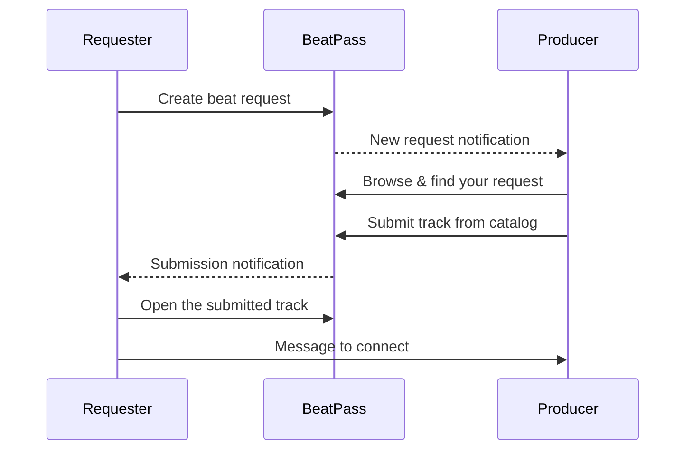

When you create a Beat Request, producers can respond by sending tracks from their BeatPass catalog. This page explains the current submission-review flow so you know what BeatPass shows today and what still happens through notifications and messaging.

---

## How Submissions Work

### The Flow

1. You create a beat request with your specifications
2. Producers browse active requests and find yours
3. They submit tracks from their catalog that match
4. You receive notifications for each submission
5. You review the submissions and connect with producers you like

### What You Receive

Each submission includes:
- **The track itself** — An existing beat from the producer's BeatPass catalog
- **Producer information** — Who submitted it
- **Submission time** — When they sent it

<Note>
  Submissions are existing BeatPass tracks, not guaranteed custom-made beats. That is why responses can arrive quickly during the live request window.
</Note>

---

## Getting Notified

When a producer submits a beat to your request, you'll be notified based on your settings:

### Notification Channels

| Channel | How It Works |
|---------|--------------|
| **In-app** | Badge in notification center, visible on site |
| **Email** | Email sent to your registered address |
| **Browser push** | Desktop notification if you have them enabled |

### Configuring Notifications

1. Click the **notification icon** (bell) in the top navigation bar
2. Click the **settings icon** (gear) to open **Notification Preferences**
3. Find **Beat Requests** section → **Beat Submissions**
4. Toggle on/off for each channel (Email, Browser, In-App)

<Tip>
  Keep at least one notification channel enabled so you don't miss submissions during your request window.
</Tip>

---

## Viewing Submissions

### What BeatPass Shows Today

BeatPass currently centers the review flow around:

- **Your notification center** — Each submission can generate a notification
- The submitted **track page** opened from that notification
- **Submission counts** on your request cards

### What You Can Expect on the Current UI

- Your request card can show how many beats have been submitted
- Notifications can take you directly to the submitted track
- Messaging remains the main follow-up channel after you find a producer you want to talk to

<Warning>
  BeatPass does not currently provide a dedicated submissions inbox inside request details. If you want a direct path back to each submitted track, open or keep the notification that arrived when the beat was sent.
</Warning>

---

## Reviewing Submissions

### Quality Check

When reviewing submissions, consider:
- **Does it match your request?** — Check genre, mood, and BPM
- **Compare to your reference** — Is it similar to what you asked for?
- **Production quality** — Is it well-mixed and professional?
- **Would you use this?** — Can you see yourself recording to it?

### Multiple Submissions

You may receive many submissions to a single request:
- **Review them all** — Different producers have different strengths
- **Multiple producers** — Any number of producers can submit to your request
- **Up to 5 tracks per producer** — Each producer can submit up to 5 different tracks per request
- **Take notes outside the request card** — The current request-management UI shows counts, not a built-in inbox of every response

<Info>
  Requests stay open for the full duration you selected (24, 48, or 72 hours) regardless of how many submissions you receive. This gives more producers a chance to respond.
</Info>

---

## Connecting with Producers

### If You Like a Submission

Found a beat you love? Here's what to do:

1. Open the submitted track or the producer's profile
2. Click **Message** to start the conversation
3. Discuss licensing, exclusivity, pricing, or next steps directly with the producer

### Starting a Conversation

To message a producer about their submission:
1. Click on their name or profile
2. Click the **Message** button
3. Introduce yourself and mention the submission
4. Discuss your interest and any questions

### What to Discuss

- Whether the beat is available for licensing
- Exclusive vs. non-exclusive options
- Pricing if budget was mentioned
- Timeline for your project
- Any modifications needed

<Note>
  BeatPass facilitates the connection but doesn't handle payment for custom negotiations. Work out the details directly with the producer.
</Note>

---

## After the Request Expires

### What Happens at Expiration

- **Request closes** — No new submissions can be sent
- **Existing notifications and conversations still matter** — You can continue following up with producers you already discovered
- **Renewal may be available** — Eligible requests can be renewed within 30 days for **1 token**

### Continuing the Conversation

Even after expiration:
- You can still message producers who submitted
- You can still visit their profiles
- You can still license their submitted tracks through normal means

---

## Submission Counts

Your request displays a submission count showing how many tracks have been submitted:

| Count | What It Means |
|-------|---------------|
| **0** | No submissions yet |
| **1-5** | Early responses coming in |
| **5-15** | Good level of interest from multiple producers |
| **15+** | High demand for your request |

<Tip>
  If you're not getting submissions, consider whether your specifications are clear and your reference track is accessible.
</Tip>

---

## Common Questions

<AccordionGroup>
  <Accordion title="Can producers submit more than one beat?">
    Yes. A producer can submit up to 5 different tracks to the same request. Each exact track can only be submitted once to that request.
  </Accordion>
  
  <Accordion title="Can I reject a submission?">
    There's no formal rejection process. Simply don't respond to submissions you're not interested in. Producers understand not every submission will be a match.
  </Accordion>
  
  <Accordion title="What if no one submits?">
    If your request doesn't receive submissions, consider:
    - Was your description clear enough?
    - Was your reference track accessible?
    - Was the genre popular on the platform?
    You can create a new request with better details, or renew an eligible expired request for 1 token.
  </Accordion>
  
  <Accordion title="Where do I open submitted tracks?">
    In the current experience, the most reliable path is the submission notification. BeatPass also shows the submission count on your request cards so you know activity is happening even before you open the track.
  </Accordion>
  
  <Accordion title="Do submissions cost the producer anything?">
    No. Producers can submit to requests for free. They're sharing existing tracks from their catalog.
  </Accordion>
</AccordionGroup>

---

## Related Topics

<CardGroup cols={2}>
  <Card title="Managing Requests" icon="list-check" href="/help/beat-requests/managing-requests">
    View and manage all your requests.
  </Card>
  <Card title="Messaging" icon="comment" href="/help/messaging">
    Connect with producers about their submissions.
  </Card>
</CardGroup>
