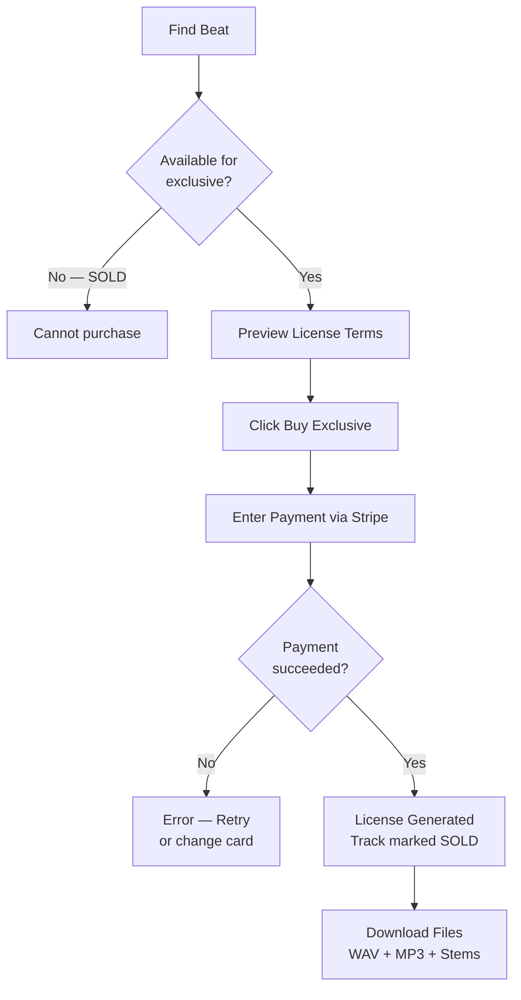

## Overview

Purchasing an exclusive license is a one-time transaction that gives you sole and exclusive rights to a beat. Payment is processed securely via Stripe.

<Info>
  Exclusive purchases are separate from subscription plans and available to all users.
</Info>

---

## Requirements

Before purchasing exclusive:

| Requirement | Details |
|-------------|---------|
| **BeatPass account** | Must be signed in |
| **Track availability** | Track must not already be sold exclusively |
| **Exclusive pricing** | Producer must have set an exclusive price |
| **Payment method** | Credit or debit card |

---

## Step-by-Step Purchase

<Steps>
  <Step title="Find the Beat">
    Browse or search for a beat you want to purchase exclusively. Beats with exclusive pricing show the price on their track page.
  </Step>
  
  <Step title="Check Status">
    Ensure the track shows **"Available"** for exclusive purchase.
    
    If it shows **"SOLD"**, someone else already purchased exclusive rights.
  </Step>
  
  <Step title="Preview License Terms">
    Click **"Preview License"** to review:
    - Publishing split (default: 20% producer / 80% you)
    - Territory and jurisdiction
    - Files included
    - Rights granted
  </Step>
  
  <Step title="Initiate Purchase">
    Click **"Buy Exclusive"** or similar purchase button.
  </Step>
  
  <Step title="Complete Payment">
    Enter your payment details in the Stripe checkout:
    - Credit or debit card
    - Billing information
    - Confirm payment
  </Step>
  
  <Step title="Payment Processing">
    Stripe processes the payment. Upon success:
    - Payment status updates to "succeeded"
    - Exclusive license certificate is generated
    - Track is marked as "SOLD"
    - Producer is notified of sale
  </Step>
  
  <Step title="Receive Confirmation">
    You receive:
    - Email with license certificate
    - Access to download files (WAV, MP3, stems)
    - License viewable in your Library
  </Step>
</Steps>

---

## Payment Details

### Payment Processing

| Provider | Stripe |
|----------|--------|
| **Methods** | Credit card, Debit card |
| **Currency** | Set by producer (USD default) |
| **Security** | PCI-compliant, encrypted |

### What Happens on Success

1. Payment is confirmed by Stripe
2. Purchase is marked as completed
3. Exclusive license certificate is generated
4. Track is marked as **SOLD**
5. Confirmation emails sent to you and the producer

### What Happens on Failure

If payment fails:
- You see an error message explaining the issue
- No license is generated
- Track remains available for purchase
- You can retry with the same or different payment method

---

## After Purchase

### Immediate Access

| Item | Access |
|------|--------|
| **License Certificate** | Viewable immediately |
| **WAV file** | Download ready |
| **MP3 file** | Download ready |
| **Stems** | Download ready (if provided) |
| **Certificate PDF** | Download ready |

### Track Status

The track now shows:
- **Status:** SOLD
- **Exclusive Owner:** Your name (masked to others)
- **Non-exclusive:** No longer available

### Producer Payout

- Producer receives sale notification
- Their share is processed through BeatPass payouts
- Timing depends on payout schedule

---

## Pricing

Exclusive pricing is set by the producer:

| Factor | Details |
|--------|---------|
| **Minimum** | No platform minimum |
| **Maximum** | No platform maximum |
| **Currency** | Producer-selected |
| **Platform fee** | 12% + \$3 added on top of producer's price |

<Note>
  Exclusive prices vary widely based on producer reputation, beat quality, and market demand. Prices typically range from \$100 to \$5,000+.
</Note>

---

## Cancellations & Refunds

### Before Payment Completes

- You can close the checkout at any time
- No charge occurs
- Track remains available

### After Payment Completes

- All exclusive sales are **final** once the beat is downloaded or a license is generated
- Refund requests are only considered within **24 hours** of purchase, and only if you have **not downloaded** any files
- After 24 hours, the purchase is considered a deliberate, non-accidental transaction
- If a refund is approved, the exclusive license is revoked and the beat is re-listed

For full details, see the [Refund Policy](/help/billing/refund-policy).

---

## Troubleshooting

<AccordionGroup>
  <Accordion title="Payment was declined">
    - Check card details are correct
    - Ensure sufficient funds
    - Contact your bank if issues persist
    - Try a different payment method
  </Accordion>
  
  <Accordion title="Track shows SOLD but I didn't buy it">
    Someone else purchased exclusive rights before you completed checkout. Exclusive availability is first-come, first-served.
  </Accordion>
  
  <Accordion title="Didn't receive license email">
    - Check spam/junk folder
    - Verify email address in account settings
    - Access license from Library → Licenses
    - Contact support if still missing
  </Accordion>
  
  <Accordion title="Payment succeeded but no license">
    - Wait 5 minutes for processing
    - Check Library → Licenses
    - Contact support with payment receipt
  </Accordion>
</AccordionGroup>

---

## Related

<CardGroup cols={2}>
  <Card title="What is Exclusive" icon="crown" href="/help/downloads-and-licensing/exclusive-licenses/what-is-exclusive">
    Understanding exclusive rights.
  </Card>
  <Card title="License Certificates" icon="file-certificate" href="/help/downloads-and-licensing/license-certificates">
    Your exclusive license document.
  </Card>
</CardGroup>
