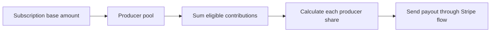

import PlatformFee from "/snippets/callouts/platform-fee.mdx";

BeatPass uses a <Tooltip tip="A score calculated from track age, plays, and credited producers. It determines how much subscription revenue a track contributes." cta="See the formula" href="/help/earnings/contribution-system/formula">contribution value</Tooltip> system to share subscription revenue among producers.

## What Builds Contribution Value

<CardGroup cols={3}>
  <Card title="Time Since Upload" icon="clock">
    Newer tracks get a stronger recency factor, which decays over time with a 6-month half-life.
  </Card>
  <Card title="Play Activity" icon="play">
    More plays increase the popularity boost, up to a maximum 3x multiplier.
  </Card>
  <Card title="Collaborator Count" icon="users">
    Contribution is split equally across the producers credited on the track.
  </Card>
</CardGroup>

## How Subscription Payout Share Works

1. BeatPass takes the subscription base amount as the producer pool
2. All eligible track contribution values are summed
3. Your producer share is calculated from your contribution divided by the platform total
4. Eligible producers receive their share through the payout flow

<PlatformFee />

## Important Rules

### Exclusive-Only Tracks

Tracks marked **exclusive-only** do not contribute to the subscription pool. They can still earn through direct sales, but their contribution value for subscription sharing is treated as zero.

### Ineligible Producers

If a producer is not payout-ready when a subscription split runs, their share can be excluded and redistributed among eligible producers.

### Daily Refresh

BeatPass recalculates contribution values on a roughly 24-hour cycle so new plays and time decay continue to affect the next payout calculations.

## Related

<CardGroup cols={2}>
  <Card title="Earnings Formula" href="/help/earnings/contribution-system/formula" icon="calculator">
    See the exact formula BeatPass uses.
  </Card>
  <Card title="Maximizing Earnings" href="/help/earnings/contribution-system/maximizing-earnings" icon="arrow-trend-up">
    Learn practical ways to improve contribution and earnings.
  </Card>
</CardGroup>
