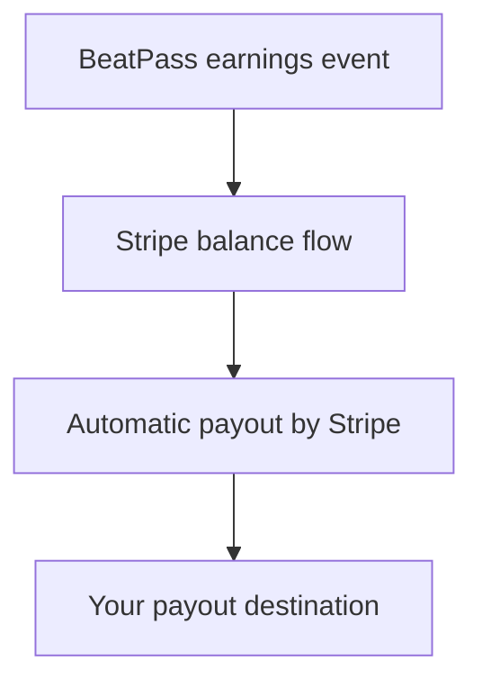

import SupportContact from "/snippets/sections/support-contact.mdx";

BeatPass and Stripe handle different parts of the payout timeline. BeatPass calculates or records the earnings event, then Stripe handles the balance and final transfer to your payout destination.

## The Two Main Earning Paths

<CardGroup cols={2}>
  <Card title="Track Sales" icon="shopping-bag">
    Direct purchases appear in your earnings history and then move through Stripe's payment and payout flow.
  </Card>
  <Card title="Subscription Payouts" icon="repeat">
    Subscription revenue moves through BeatPass split statuses before reaching Stripe.
  </Card>
</CardGroup>

## Subscription Payout Statuses

BeatPass can show these statuses in **Transactions**:

| Status | What It Means |
|--------|----------------|
| **Queued** | The split exists, but it is still waiting to move |
| **Sending** | BeatPass is actively pushing the split toward Stripe |
| **Paid** | The split has reached the Stripe side of the flow |
| **Failed** | The transfer encountered an error |
| **Excluded** | Your payout setup was not eligible when the split ran |

<Info>
  On subscription payouts, **Paid** means the split made it to Stripe. It does not guarantee the bank transfer has already finished.
</Info>

## What Account Overview Means

Your **Account Overview** cards help you understand where money is:

| Card | Meaning |
|------|---------|
| **Balance** | Ready for payout |
| **Upcoming** | Scheduled or queued to move next |
| **In Transit** | Already moving to your bank or payout destination |
| **Lifetime** | Total earned so far |

## What Can Change the Timeline

The exact arrival time is not fixed by BeatPass alone. Delays or differences can come from:

- Incomplete Stripe Connect setup
- Subscription splits that remain **Queued** until they can move
- Stripe verification or review requirements
- Bank processing times
- Currency handling on multi-currency accounts

<Warning>
  BeatPass does not publish a guaranteed per-country payout speed in help docs because the final timing depends on Stripe and the payout destination you use.
</Warning>

## What to Do If Something Looks Stuck

1. Open **Backstage** → **Finances**
2. Check whether the issue is **Queued**, **Failed**, or **Excluded**
3. Make sure Stripe Connect is fully active
4. Give Stripe or your bank time to finish the transfer if the money is already **In Transit**

If the status stays wrong for too long:

<SupportContact />
