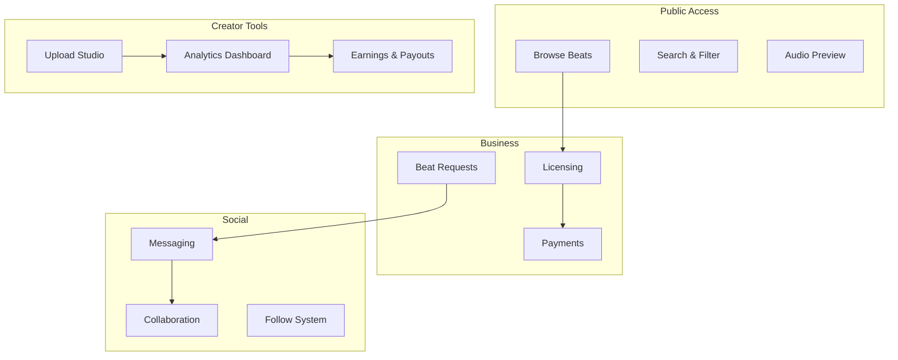

## Platform Architecture

BeatPass is organized into interconnected modules that serve different user needs while sharing common data and services.

---

## Core Modules

---

## Feature Areas

<Tabs>
  <Tab title="Discovery">
    ### Beat Discovery
    - **Browse** - Explore by genre, mood, trending
    - **Search** - Find by keyword, producer, BPM, key
    - **Filter** - Narrow by attributes (tempo, scale, duration)
    - **Preview** - Stream full tracks before licensing
    - **Waveforms** - Visual audio representation
  </Tab>
  
  <Tab title="Creator Studio">
    ### Producer Tools
    - **Upload Studio** - Multi-format upload with metadata
    - **Track Manager** - Edit, archive, or delete tracks
    - **Analytics** - Plays, saves, completions, audience data
    - **Earnings Dashboard** - Revenue tracking and projections
    - **Producer Intelligence** - XP, achievements, leaderboards
  </Tab>
  
  <Tab title="Business">
    ### Licensing & Payments
    - **License Types** - Non-exclusive, exclusive options
    - **Pricing** - Producer-set pricing with platform guidelines
    - **Checkout** - Secure payment processing
    - **Certificates** - Downloadable license documentation
    - **Payouts** - Scheduled earnings distribution
  </Tab>
  
  <Tab title="Collaboration">
    ### Social Features
    - **Beat Requests** - Artists post needs, producers respond
    - **Messaging** - Direct communication between users
    - **Following** - Stay updated on favorite producers
    - **Playlists** - Curate and share your own sets of tracks
  </Tab>
</Tabs>

---

## User Journeys

### Producer Journey

<Steps>
  <Step title="Onboard">
    Create account, verify email, complete producer profile
  </Step>
  <Step title="Upload">
    Add beats with metadata, set pricing and terms
  </Step>
  <Step title="Promote">
    Share tracks, respond to requests, engage with audience
  </Step>
  <Step title="Earn">
    Accumulate plays and saves, receive contribution-based payouts
  </Step>
  <Step title="Grow">
    Analyze performance, optimize uploads, climb leaderboards
  </Step>
</Steps>

### Artist Journey

<Steps>
  <Step title="Discover">
    Browse catalog, filter by project needs
  </Step>
  <Step title="Preview">
    Stream tracks, save favorites to library
  </Step>
  <Step title="License">
    Select license type, complete purchase
  </Step>
  <Step title="Download">
    Get high-quality files and license certificate
  </Step>
  <Step title="Create">
    Use beat in your project per license terms
  </Step>
</Steps>

---

## Data Flow

| From | To | What Flows |
|------|-----|------------|
| Upload | Analytics | Track metadata, initial metrics |
| Plays | Contribution | Play events, durations, user signals |
| Contribution | Earnings | Calculated revenue share |
| Earnings | Payouts | Scheduled distributions |
| Requests | Messaging | Collaboration opportunities |

---

## Next Steps

<CardGroup cols={2}>
  <Card title="Terminology" icon="book" href="/help/home/terminology">
    Learn platform-specific terms.
  </Card>
  <Card title="Getting Started" icon="rocket" href="/help/help/getting-started/checklist">
    Begin your onboarding.
  </Card>
</CardGroup>
